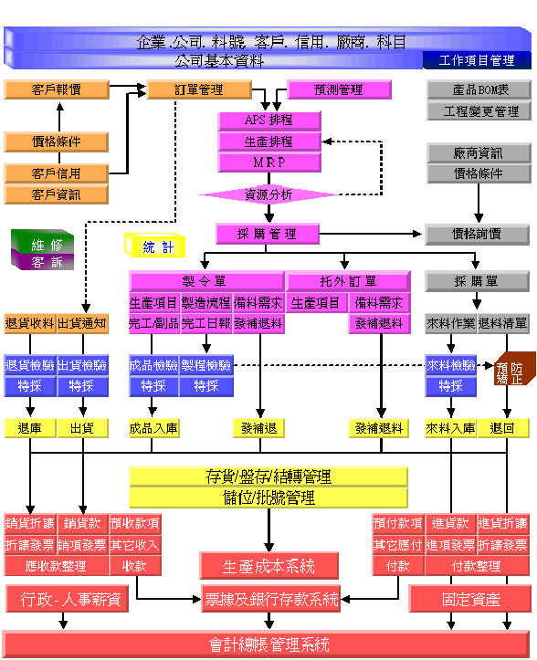

# FastERP2

FastERP-2整合企業營運流程，结合應用软體系统(如進銷存、会計傅票、生產製造、出口貿易、電子商務..)協助企業内部對资源整合的需求，提供對未来管理的營運功能，增加競争力與决策支援分析能力，將企業運作流程標準化，整合整體管理應用系统，提昇企業營運績效。

* **商務整合**

    符合企業管理流程，整合進銷存、物料、製造、品管、工程、資產、財務、稅務、人力資源、貿易、電子商務、決策分析、電子訊息等功能，發揮企業整體資源。

* **機動管理**

    單據審批作業采用電子訊息(郵件)等方式傳遞，達到無紙化辦公的境界多層次商務軟體，采用資料庫維護更新容易並擁有完善的安全保障。

* **遠程控管**

    客戶與廠商可以隨時透過網路查閲處理狀況，運用網際網絡控管，營運管理無時差沒有距離限制。

## 特色

* FastERP-2所有管理模組均可採用自由組合方式，依使用者需求可任意變換軟體功能。

* 以前是大吃小的時代，現在是快吃慢的競爭環境，FastERP操作簡便、使用快速。適合買賣業、貿易業、製造工廠靈活搭配使用。

* 符合企業管理流程，整合進銷存、物料、製造、品管、工程、資產、財務、人力資源、貿易、電子商務、決策分析、電子訊息等模組，企業整體資源全方位發揮。

* 採用先進跨國性之多層結構式軟體技術，利用網際網路，遠距離、跨國界使用營運資料庫，無管理時差，沒有地域限制。無論何時何地，快速掌握公司經營脈動。

* 使用軟體物件導向式技術，發展精靈元件，軟體維護更新快速、容易。

* 客戶←工廠←供應鏈，不用特定電腦設備同步完成作業，構築快速、精準的工廠營運網站。

* 依照不同的使用需求自行定義各式統計報表、圖表，加強營運管理能力。

* 單據審核、統計分析報表採用電子訊息與內建E-Mail傳送，節省大量的營運成本。

* 可查閱最新產品訊息、訂單處理狀況、應收帳款，加強客戶關係。

* 可查閱產品交貨狀況、品質檢驗報告、核對應付帳款，強化供應鏈資源。

* 採用SQL資料庫擁有完善的維護措施，安全有保障。

* 可多公司、多幣別、多套帳，俱備ISO品質管理精神，符合企業e化，增強競爭力的需求。